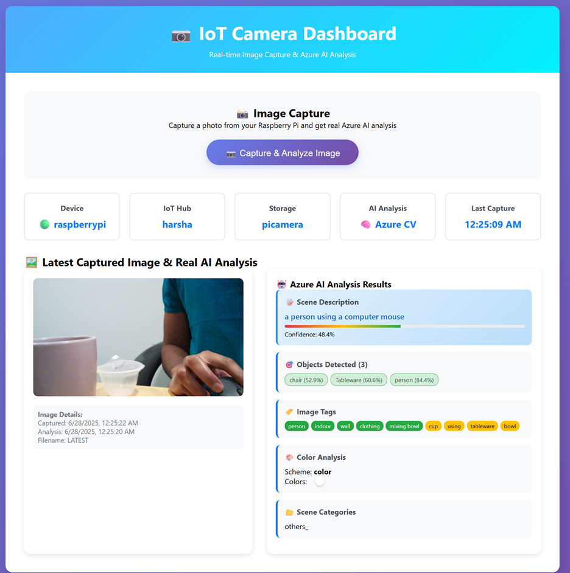
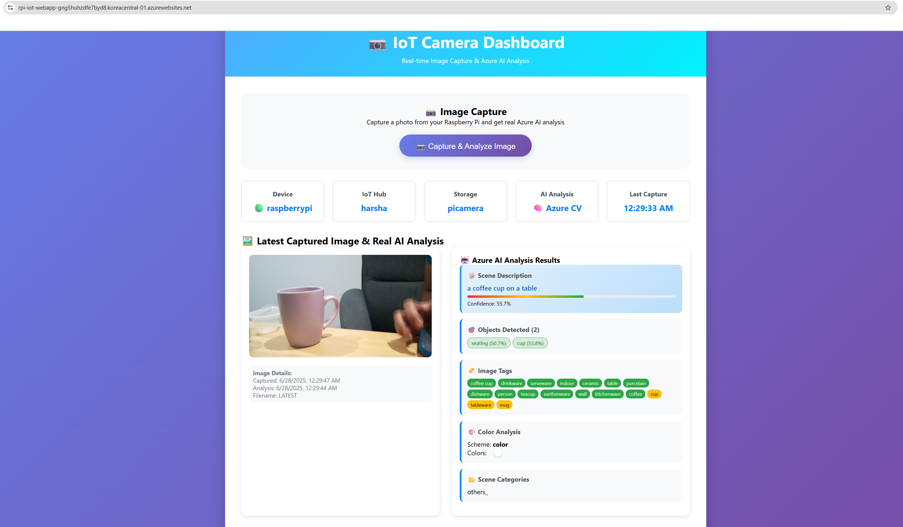

# IoT Camera Dashboard with Azure AI Analysis

A comprehensive IoT camera dashboard that captures images from a Raspberry Pi, stores them in Azure Blob Storage, and performs real-time AI analysis using Azure Computer Vision.

## Features

- 📷 **Remote Image Capture** - Send capture commands to Raspberry Pi via Azure IoT Hub
- 🏗️ **Azure Integration** - Seamless integration with Azure IoT Hub and Blob Storage
- 🤖 **Real-time AI Analysis** - Powered by Azure Computer Vision API
- 🖼️ **Image Display** - View captured images with detailed analysis results
- 📊 **Rich Analytics** - Object detection, scene description, color analysis, and more
- 📱 **Responsive Design** - Works on desktop and mobile devices
- ⚡ **Real-time Updates** - Live status monitoring and instant results

## Architecture

```
Raspberry Pi → Azure IoT Hub → Web Dashboard → Azure Computer Vision
     ↓              ↓                ↓              ↓
Image Capture → Command Relay → UI Display → AI Analysis
     ↓
Azure Blob Storage
```

## Prerequisites

### Azure Services
- **Azure IoT Hub** - For device communication
- **Azure Blob Storage** - For image storage
- **Azure Computer Vision** - For AI analysis

### Hardware
- Raspberry Pi with camera module
- Internet connection

## Quick Start

### 1. Clone Repository
```bash
git clone https://github.com/yourusername/iot-camera-dashboard.git
cd iot-camera-dashboard
```

### 2. Setup Raspberry Pi (Automated)
```bash
# On your Raspberry Pi, run:
curl -sSL https://raw.githubusercontent.com/yourusername/iot-camera-dashboard/main/raspberry-pi/install.sh | bash

# Then configure with your Azure credentials:
nano /home/pi/iot-camera/config.env
```

### 3. Configure Web Dashboard
Update the configuration in `index.php`:
```php
$config = [
    'iot_hub_connection_string' => 'HostName=your-hub.azure-devices.net;SharedAccessKeyName=service;SharedAccessKey=your-key',
    'device_id' => 'raspberrypi',
    'iot_hub_name' => 'your-hub-name',
    'storage_account' => 'your-storage-account',
    'container' => 'camera-images',
    'computer_vision_endpoint' => 'https://your-region.cognitiveservices.azure.com/',
    'computer_vision_key' => 'your-computer-vision-key'
];
```

### 4. Deploy & Run
```bash
# Deploy web dashboard to your server
# Start Pi camera service
sudo systemctl start iot-camera

# Access dashboard and click "Capture & Analyze Image"
```

## File Structure

```
iot-camera-dashboard/
├── index.php              # Main web dashboard
├── README.md              # This file
├── LICENSE                # MIT License
├── .gitignore            # Git ignore rules
├── SETUP.md              # Detailed setup guide
├── raspberry-pi/         # Raspberry Pi camera client
│   ├── camera_client.py  # Main Pi application
│   ├── requirements.txt  # Python dependencies
│   ├── install.sh        # Automated installer
│   ├── iot-camera.service # Systemd service file
│   └── README.md         # Pi-specific documentation
├── screenshots/          # Demo screenshots
│   ├── dashboard.png
│   ├── analysis.png
│   └── mobile.png
└── docs/                 # Additional documentation
    ├── API.md            # API documentation
    └── TROUBLESHOOTING.md # Common issues
```

## Installation

### Azure Services Setup

#### 1. Azure IoT Hub
```bash
# Create IoT Hub
az iot hub create --name your-iot-hub --resource-group your-rg --sku S1

# Register Raspberry Pi device
az iot hub device-identity create --hub-name your-iot-hub --device-id raspberrypi

# Get connection string
az iot hub connection-string show --hub-name your-iot-hub --policy-name service
```

#### 2. Azure Storage
```bash
# Create storage account
az storage account create --name yourstorageaccount --resource-group your-rg --sku Standard_LRS

# Create container with public access
az storage container create --name camera-images --account-name yourstorageaccount --public-access blob
```

#### 3. Azure Computer Vision
```bash
# Create Computer Vision resource
az cognitiveservices account create --name your-computer-vision --resource-group your-rg --kind ComputerVision --sku S1

# Get API key and endpoint
az cognitiveservices account keys list --name your-computer-vision --resource-group your-rg
az cognitiveservices account show --name your-computer-vision --resource-group your-rg --query properties.endpoint
```

### Raspberry Pi Setup

#### Automated Installation (Recommended)
```bash
curl -sSL https://raw.githubusercontent.com/yourusername/iot-camera-dashboard/main/raspberry-pi/install.sh | bash
```

#### Manual Installation
See [raspberry-pi/README.md](raspberry-pi/README.md) for detailed instructions.

### Web Dashboard Setup

1. **Deploy to Web Server**
   ```bash
   # Apache/Nginx with PHP support required
   cp index.php /var/www/html/
   ```

2. **Configure Credentials**
   Update the `$config` array in `index.php` with your Azure credentials.

3. **Set Permissions**
   ```bash
   sudo chown -R www-data:www-data /var/www/html/
   sudo chmod 755 /var/www/html/index.php
   ```

## Usage

### Web Dashboard
1. Access the dashboard in your browser
2. Click "📷 Capture & Analyze Image"
3. Wait for image capture and AI analysis
4. View results with detailed insights

### API Endpoints
- `GET /?api=status` - System status
- `POST /?api=capture` - Trigger image capture
- `GET /?api=real_analysis&filename=image.jpg` - Analyze image

### Raspberry Pi Methods
The Pi responds to these IoT Hub method calls:
- `capture_image` - Capture and upload image
- `get_device_info` - Get device status
- `test_storage` - Test storage connectivity
- `ping` - Connectivity test

## Analysis Features

### 🤖 AI Analysis Results
- **Scene Description** - Natural language description
- **Object Detection** - Objects with confidence scores
- **Image Tags** - Categorized by confidence level
- **Color Analysis** - Dominant colors and schemes
- **Scene Categories** - Environment classification
- **Face Detection** - People count
- **Brand Recognition** - Identified brands

## Screenshots

### Dashboard Overview


### AI Analysis Results



## Configuration

### Environment Variables (Recommended)
```bash
# Web Dashboard
IOT_HUB_CONNECTION_STRING="HostName=..."
COMPUTER_VISION_ENDPOINT="https://..."
COMPUTER_VISION_KEY="your-key"

# Raspberry Pi
DEVICE_CONNECTION_STRING="HostName=...;DeviceId=raspberrypi;SharedAccessKey=..."
STORAGE_CONNECTION_STRING="DefaultEndpointsProtocol=https;AccountName=...;AccountKey=..."
```

### Debug Mode
Enable debug information by changing CSS in `index.php`:
```css
.debug-info { display: block; }
```

## Troubleshooting

### Common Issues

#### Image Not Displaying
- ✅ Check Azure Blob Storage container is public
- ✅ Verify image filename format
- ✅ Ensure sufficient upload delay

#### Analysis Fails
- ✅ Verify Computer Vision credentials
- ✅ Check image URL accessibility
- ✅ Ensure supported image format

#### Pi Connection Issues
- ✅ Verify IoT Hub connection string
- ✅ Check device registration
- ✅ Test network connectivity

### Service Management
```bash
# Raspberry Pi service
sudo systemctl status iot-camera
sudo journalctl -u iot-camera -f

# Web server logs
sudo tail -f /var/log/apache2/error.log
```

## Development

### Adding Features
- **New Analysis**: Extend `formatRealAnalysis()` function
- **UI Components**: Modify HTML/CSS sections
- **API Endpoints**: Add cases to API switch statement
- **Pi Methods**: Add handlers in `camera_client.py`

### Testing
```bash
# Test Pi setup
cd /home/pi/iot-camera && ./test.sh

# Test Azure connectivity
az iot hub device-identity show --hub-name your-hub --device-id raspberrypi

# Manual method call
az iot hub invoke-device-method --hub-name your-hub --device-id raspberrypi --method-name ping
```

## Security

### Best Practices
- 🔐 Use environment variables for credentials
- 🔄 Regularly rotate access keys
- 📊 Monitor access logs
- 🛡️ Use HTTPS in production
- 🔒 Implement authentication for web dashboard

### Network Security
- Configure firewall rules
- Use VPN for remote access
- Implement rate limiting
- Monitor for unauthorized access

## Performance

### Optimization Tips
- Adjust image quality based on bandwidth
- Implement result caching
- Use CDN for static assets
- Monitor resource usage
- Optimize database queries (if added)

## Contributing

1. Fork the repository
2. Create a feature branch (`git checkout -b feature/amazing-feature`)
3. Commit your changes (`git commit -m 'Add amazing feature'`)
4. Push to the branch (`git push origin feature/amazing-feature`)
5. Open a Pull Request

### Development Setup
```bash
git clone https://github.com/yourusername/iot-camera-dashboard.git
cd iot-camera-dashboard

# Setup development environment
# See SETUP.md for detailed instructions
```

## License

This project is licensed under the MIT License - see the [LICENSE](LICENSE) file for details.

## Roadmap

- [ ] Multi-device support
- [ ] Real-time streaming
- [ ] Mobile app
- [ ] Advanced analytics dashboard
- [ ] Machine learning model training
- [ ] Edge AI processing
- [ ] Notifications and alerts
- [ ] Time-lapse functionality

## Acknowledgments

- Azure IoT Hub for reliable device communication
- Azure Computer Vision for powerful AI analysis
- Open source community for inspiration and support
- Raspberry Pi Foundation for amazing hardware

